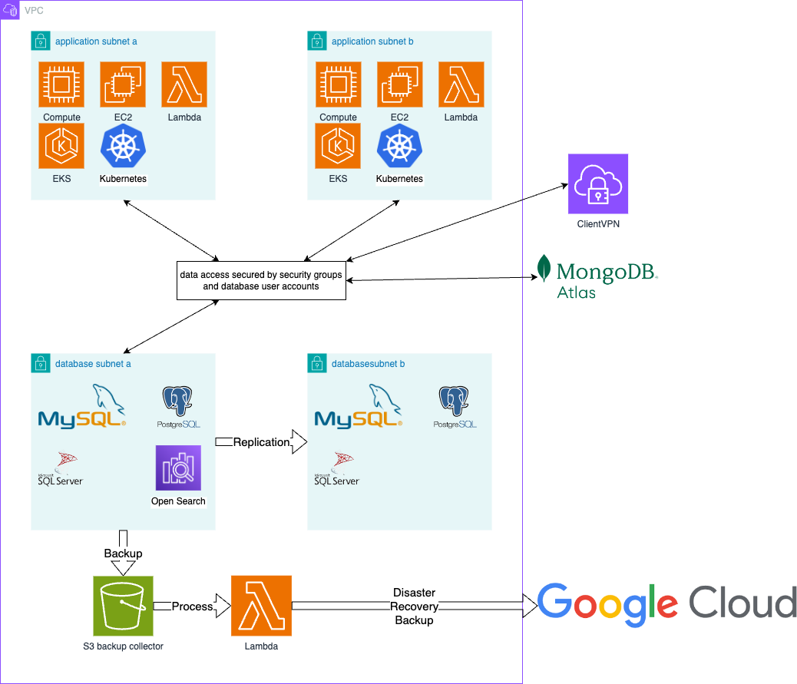

# ds-infrastructure-databases
## General Infrastructure Architecture

There are three different way how databases are run. Dependent of complexity of setup and maintenance.
OpenSearch is run as a service (installation is not done in this repository).
Microsoft SQL server is using RDS (installation is not done in this repository).

PostgresSQL and MySQL are installed on self-maintained EC2 instances.
Databases are replicated in staging and live and the data is kept on an attached EBS.


## Initialising AMI for MySQL and PostgreSQL.
Use GitHub Actions to create a general purpose AMI for MySQL or PostgreSQL.
The AMI only contains an image of an EC2 with basic setup for administrative users and network access defined in Secrets Manager and can be deployed and configured to fit the needs.
For more details read sections underneath.

## Creating an general PostgreSQL AMI
Setup is minimal and only contains the postgres server, network settings and database administrator accounts with the appropriate permissions.
### postgres server
This is the standard installation of postgres14 using amazon-linux-extras. It is recommended that the available are monitored and update if and when required.
### network settings
The instance will be placed in a private db subnet. To define the subnets in postgres from which incoming traffic is allowed, the secret

## Setup Replication for PostgreSQL
The required steps to create a replication setup are done manually but uses two or more instances which can be installed with the base AMI. **Install standby servers in different AZs.**  
This document describes the use of one standby server. Please refer to the PostgreSQL documentation when using more than one. The location of the conf files as well as parameters can change when switching to other version. [PostgreSQL doumentation](https://www.postgresql.org/docs/)
### Primary Server
in */var/lib/pgsql/data/postgresql.conf*  
Following lines are not in order or might contain other values initially
```conf file
#wal_level = replica
#wal_log_hints = off
#max_replication_slots = 10
#max_wal_senders = 10
#archive_mode = on
#archive_command = ''
#cluster_name = ''
#synchronous_standby_names = ''
```
uncomment and change or add to
```conf file
wal_level = logical
wal_log_hints = on
max_replication_slots = 10
max_wal_senders = 10
archive_mode = on
archive_command = 'test ! -f /mnt/server/archivedir/%f && cp %p /mnt/server/archivedir/%f'
cluster_name = 'Metis'
synchronous_standby_names = 'ANY 1(Adrastea)'
```
in */var/lib/pgsql/data/pg_hba.conf* on the primary server add following line and replace the spaceholders with the correct values

```conf file
host all [replication_user] [CIDR_of_subnet] md5
```

### Standby Server
Create a base backup [Postgres documentation](https://www.postgresql.org/docs/14/app-pgbasebackup.html)
```pg_basebackup -h Metis -D /usr/local/pgsql/data```

in */var/lib/pgsql/data/postgresql.conf*
```
cluster_name = 'Adrastea'
primary_conninfo = 'host=[host_ip] port=5432 user=[replication_user] password=[password]'
```
